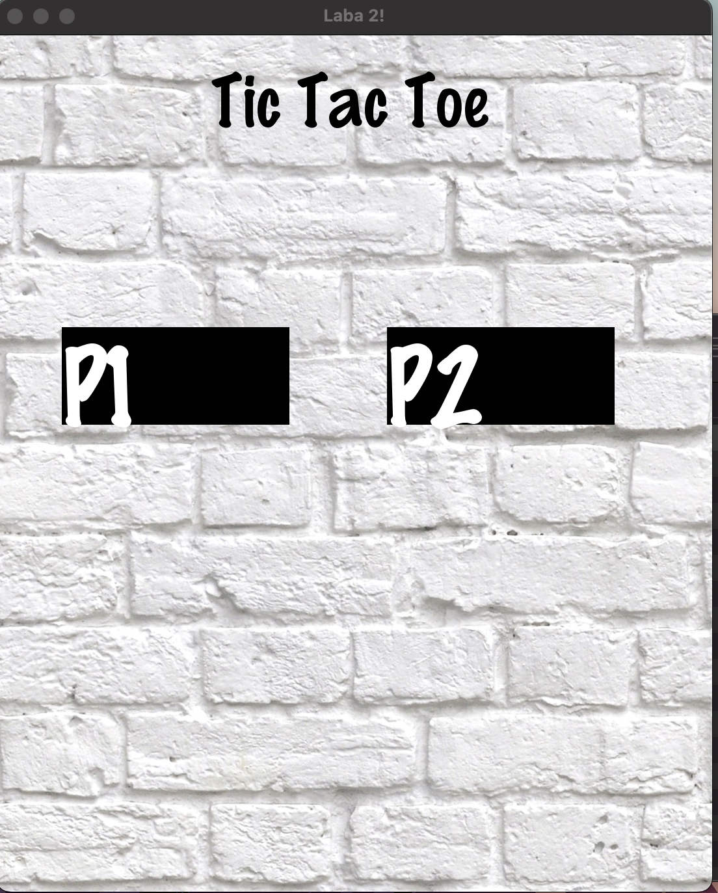
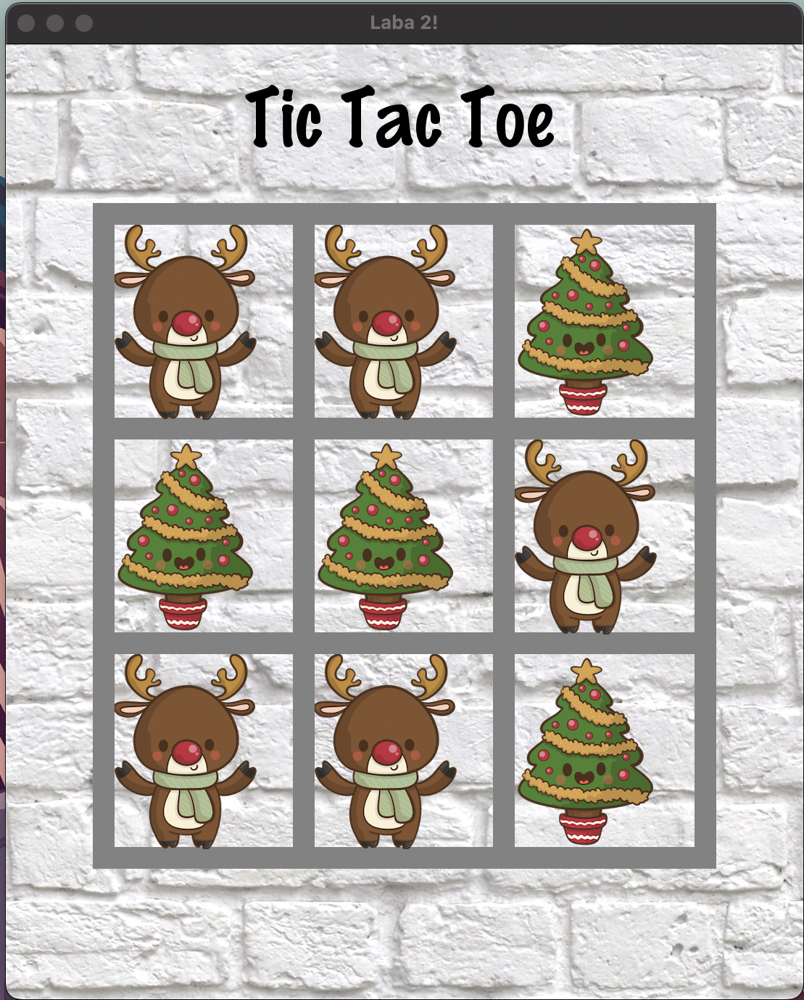

# Laboratory work semester 3 Object-oriented programming

## Laboratory work 1

### Problem statement
You need to write a program in C++ to compare different sorting algorithms. Write a brief technical task (TOR). Execute the implementation. Write tests for her

### Minimum requirements for the program. 
At least 2 different algorithms must be implemented in the program (see Table. "Choice of options" below). The main algorithms need to be covered with tests. This also applies to the previously implemented Sequence type . The program should allow you to select any of the implemented sorting algorithms and run it on (rather arbitrary) source data. Sorting algorithms should be parameterized by the way elements are compared. At the same time, it should be possible to both automatically and manually check the correctness of the algorithms (including it should be possible to view both the source data and the result – by means of output to the screen or/and output to a file). The program must have a user interface (console or graphical). The program should allow checking the operation of algorithms on long sequences (10,000 elements or more); it should be possible to automatically generate sequences of a given length (for example, using a random number generator). The user interface, especially the graphical one, does not need to be tested. The program should provide a function for measuring the execution time of the algorithm. There should be a function for comparing algorithms – by execution time on the same input data .
### Methodical instructions. 
Implement an abstract data type – sequence. Perform the implementation in 2 variants - based on arrays and based on linked lists. The results obtained will be useful in subsequent tasks. Sorting algorithms can be implemented as separate functions, or encapsulated in a class inherited from the purely abstract ISorter class (interface). Signature of the sorting function:
`Template<typename T>`
`Sequence<T>* Sort(Sequence<T>* seq, int (*cmp)(T,T))`
### Variant
Realization:
+ `sortShell`
+ `sortMerge`

## Laboratory work 2

## Problem statement
Write a C++ program to compare different search algorithms. Comparison of algorithms should be performed on one of the above tasks related to information processing. Write a brief technical task (TOR). Execute the implementation. Write tests for her. Implement the user interface.

## Minimum requirements for the program
The program must implement the solution of one (or several) of the tasks listed in section 2. For many tasks, modifications are provided that complicate the task. The task should be solved using one or more methods of organizing and searching for information listed in section 3. For each method, there are various modifications that complement or improve the capabilities or characteristics of the method (and complicate the implementation). All tasks, methods and their modifications are provided with numerical ratings, which characterize the complexity and scope of implementation. At the same time, if the student chooses a modified version of the task/method, the ratings of the task/method and the selected modifications are summed up. The student independently chooses the configuration for implementation based on the condition: the total rating must be at least 55. For more information, see section 4. The total rating of the assignment chosen by the student directly affects the grade, see section 5.
The main implemented algorithms need to be covered with tests. The program should allow you to select any of the implemented search algorithms and run it on (rather arbitrary) source data. At the same time, it should be possible to both automatically and manually check the correctness of the algorithms (including the ability to view both the source data and the result). The program must have a user interface (console or graphical). The user interface, especially the graphical one, does not need to be tested. The program should provide a function for measuring the execution time of the algorithm. There should be a function for comparing algorithms – by execution time on the same input data . The program should provide functionality for building dependency graphs, or for uploading the necessary data in open formats (for example, csv).

## Variant: Implementation of the game "Tic-Tac-Toe", using the `minimax algorithm` and the `alpha-beta clipping method`, as well as the use of a graphical interface

Input:
 + game situation (location of tic-tac-toe on a two-dimensional field)

Output:
 + recommendation of the move by zeroes (coordinates on the field)

In general, the solution is based on an ordered search of possible options and the construction of a decision tree. The main difference from, for example, the backpack task is in the choice of the evaluating function. In addition, artificial restrictions should be imposed on the options under consideration: for example, if a cross or a zero is placed at a considerable distance from the ones already set, then it is not so important where exactly it will be placed. Such restrictions significantly reduce the amount of calculations.

The basics of data types are taken as:
+ `BinaryTree`
+ `Tree`

### Example of work GUI:

### Start

### Play

### Choose Player

### Choose Type of Board

### Classic Board
 

### Christmas Board
 

### Football Board
 

## Laboratory work 3

### Problem statement
Write a program in C++ that implements algorithms (search) on graphs. Write a brief technical task (TOR). Execute the implementation. Write tests for her.

### Minimum requirements for the program. 
The program must implement at least one algorithm that implements the solution of a given problem using graph data structures. The table below lists a list of tasks, data structures for their solution, as well as additional tasks. At the same time, not data structures and additional tasks are applicable for each of the main tasks. The rating is an assessment of complexity and labor intensity.
When implementing, it is necessary to adhere to the principle of generality: algorithms and data structures should be sufficiently general to solve problems of this class (within reasonable limits). For example, in some tasks, both integers and real numbers and date/time can act as weights of arcs. 
When implementing algorithms and data structures, you should use data structures (and algorithms) implemented in the framework of previous laboratory work.
The main implemented algorithms need to be covered with tests. The program should allow you to select any of the implemented search algorithms and run it on (rather arbitrary) source data. At the same time, it should be possible to both automatically and manually check the correctness of the algorithms (including the ability to view both the source data and the result). The program must have a user interface (console or graphical). The user interface, especially the graphical one, does not need to be tested. The program should provide a function for measuring the execution time of the algorithm. There should be a function for comparing algorithms – by execution time on the same input data (it is desirable to write a program based on the assumption that several such algorithms can be created). The program should provide functionality for building dependency graphs, or for uploading the necessary data in open formats (for example, csv).

### Variant

#### Implementation of tic-tac-toe from Laboratory work 2 on the graphю.
#### Implementation of several polymorphic abstract data types:
+ `ArraySequence`
+ `DynamicArray`
+ `Graph`
+ `ISorter`
+ `LinkedList`
+ `ListSequence`
+ `UnirectedGraph`

